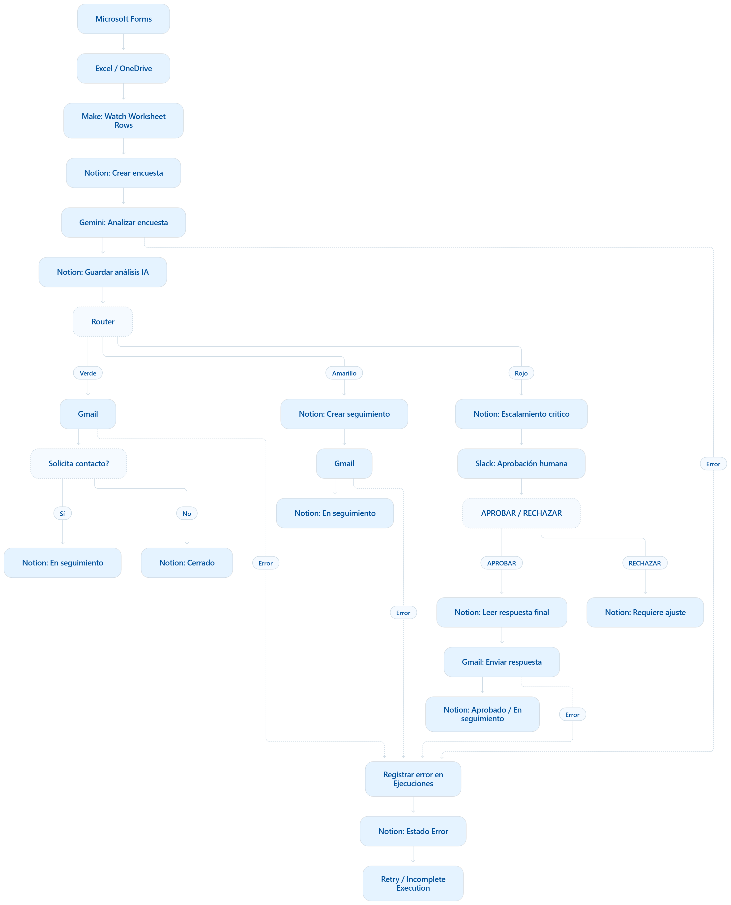

# Automatización IA para Experiencia de Clientes

Ecosistema autónomo de inteligencia artificial para procesar encuestas de satisfacción de clientes de servicio técnico automotriz, clasificar automáticamente cada experiencia y ejecutar acciones operacionales según su nivel de criticidad.

La solución integra Microsoft Forms, Excel/OneDrive, Make, Google Gemini, Notion, Gmail y Slack, incorporando automatización end-to-end, Human-in-the-Loop, trazabilidad, manejo de errores, reintentos y monitoreo operacional.

---

## Objetivo

Automatizar el procesamiento de encuestas de satisfacción posteriores a un servicio técnico, reduciendo la revisión manual y permitiendo que los casos críticos sean detectados y escalados rápidamente.

La automatización:

- recibe respuestas desde Microsoft Forms;
- procesa los datos mediante Make;
- analiza cada encuesta mediante Google Gemini;
- genera score, clasificación, sentimiento, categoría y criticidad;
- actualiza la información en Notion;
- ejecuta distintas acciones según la clasificación;
- requiere aprobación humana antes de contactar al cliente en casos críticos;
- registra éxitos, errores y recuperaciones.

---

## Arquitectura



### Flujo general

Microsoft Forms → Excel / OneDrive → Make → Notion → Gemini → Router

El Router distribuye los casos en tres rutas:

**Ruta Verde**
- Score entre 80 y 100.
- Comunicación automática mediante Gmail.
- Caso cerrado o enviado a seguimiento según solicitud de contacto.

**Ruta Amarilla**
- Score entre 50 y 79.
- Se crea una acción de seguimiento.
- Se envía comunicación al cliente.
- El caso queda en seguimiento.

**Ruta Roja**
- Score inferior a 50 o `critical_flag = true`.
- Se crea un escalamiento crítico.
- Se envía alerta a Slack.
- Se requiere aprobación humana antes de contactar al cliente.

---

## Human-in-the-Loop

Los casos críticos utilizan Slack como mecanismo de aprobación humana.

Comandos disponibles:

```text
APROBAR ENC-ID
RECHAZAR ENC-ID

### APROBAR

Cuando un caso es aprobado:

1. Make identifica el caso correspondiente.
2. Valida que la aprobación se encuentre en estado `Pendiente`.
3. Recupera la `Respuesta final` desde Notion.
4. Envía el correo al cliente mediante Gmail.
5. Registra la aprobación, fecha y usuario responsable.
6. Cambia el caso a `En seguimiento`.
7. Cambia la acción crítica a `En gestión`.
8. Registra la ejecución HITL como exitosa.

### RECHAZAR

Cuando un caso es rechazado:

1. No se envía ningún correo al cliente.
2. La aprobación cambia a `Rechazado`.
3. El caso cambia a `Requiere ajuste`.
4. La persona responsable puede modificar `Respuesta final`.
5. El caso puede volver a `Pendiente` para una nueva revisión y aprobación.

Este mecanismo permite mantener trazabilidad entre la respuesta originalmente generada por IA y el contenido finalmente autorizado por una persona.

---

## Inteligencia Artificial

El análisis de cada encuesta es realizado mediante Google Gemini.

El modelo recibe variables normalizadas desde Excel y devuelve un objeto JSON estructurado.

### Ejemplo de salida

```json
{
  "score": 5,
  "clasificacion": "Crítico",
  "sentimiento": "Muy negativo",
  "categoria": "Seguridad",
  "criticidad": "Crítica",
  "critical_flag": true,
  "resumen": "Cliente reporta una situación grave que requiere revisión prioritaria.",
  "respuesta_sugerida": "Lamentamos profundamente la situación que nos comentas."
}
```

### Variables generadas

- `score`: valor entre 0 y 100.
- `clasificacion`: Satisfecho / Oportunidad de mejora / Crítico.
- `sentimiento`: Positivo / Neutro / Mixto / Negativo / Muy negativo.
- `categoria`: categoría principal detectada en el caso.
- `criticidad`: Baja / Media / Alta / Crítica.
- `critical_flag`: indicador booleano de escalamiento obligatorio.
- `resumen`: síntesis del análisis generado por IA.
- `respuesta_sugerida`: comunicación propuesta por el modelo.

Un caso con `critical_flag = true` siempre se dirige a la ruta roja independientemente del score calculado.

---

## Modelo de datos

Notion funciona como base operacional y de trazabilidad mediante tres entidades principales.

### Experiencia de Clientes

Contiene:

- información original de la encuesta;
- identificación del cliente y servicio;
- satisfacción y recomendación;
- score y clasificación IA;
- sentimiento;
- categoría;
- criticidad;
- `critical_flag`;
- resumen generado por IA;
- respuesta propuesta por IA;
- respuesta final editable;
- estado operacional;
- aprobación humana;
- fecha y responsable de aprobación;
- relaciones con acciones y ejecuciones.

### Acciones de seguimiento

Registra las acciones operacionales generadas principalmente por las rutas amarilla y roja.

Incluye:

- tipo de acción;
- prioridad;
- estado;
- fecha de creación;
- responsable;
- categoría;
- detalle generado por IA;
- relación con el caso original.

### Ejecuciones

Funciona como capa de auditoría y observabilidad del ecosistema.

Registra:

- escenario;
- ruta;
- estado de ejecución;
- módulo;
- código de error;
- mensaje de error;
- reintento;
- identificador de ejecución cuando está disponible;
- relación con la encuesta correspondiente.

La relación entre estas entidades permite mantener trazabilidad end-to-end desde la respuesta original hasta las acciones operacionales, comunicaciones, errores y decisiones humanas.

---

## Manejo de errores y resiliencia

La solución incorpora Error Handlers en módulos críticos como Google Gemini y Gmail.

La política configurada utiliza:

- Retry automático;
- máximo de 3 intentos;
- intervalo de 15 minutos;
- registro del error en la tabla `Ejecuciones`;
- actualización del caso a estado `Error`;
- almacenamiento de ejecuciones incompletas;
- recuperación mediante Incomplete Executions de Make.

Durante las pruebas se observaron errores HTTP `503` reales de Gemini asociados a alta demanda del servicio.

La información de la ejecución fue conservada por Make y posteriormente recuperada, validando la capacidad de resiliencia del ecosistema ante fallos transitorios de servicios externos.

---

## Pruebas realizadas

Se ejecutaron cinco pruebas principales end-to-end.

| Prueba | Escenario validado | Resultado |
|---|---|---|
| 1 | Ruta Verde | Clasificación, Gmail y cierre/seguimiento correctos |
| 2 | Ruta Amarilla | Acción de seguimiento y comunicación correctas |
| 3 | Ruta Roja | Escalamiento crítico, Slack y bloqueo de comunicación |
| 4 | Human-in-the-Loop | Rechazo, modificación y aprobación posterior |
| 5 | Unhappy Path | Error externo, registro, Retry e Incomplete Execution |

Todas las rutas principales fueron validadas correctamente.

### Caso Verde

Se utilizó una encuesta con alta satisfacción y recomendación.

Resultado:

- Score dentro del rango verde.
- Clasificación `Satisfecho`.
- Correo enviado mediante Gmail.
- Caso cerrado o enviado a seguimiento según solicitud del cliente.
- Registro `OK-VERDE` creado en Ejecuciones.

### Caso Amarillo

Se utilizó una respuesta con satisfacción intermedia y oportunidades de mejora.

Resultado:

- Clasificación `Oportunidad de mejora`.
- Creación automática de acción de seguimiento.
- Prioridad operacional Media.
- Envío de comunicación mediante Gmail.
- Caso actualizado a `En seguimiento`.
- Registro `OK-AMARILLA` creado.

### Caso Rojo

Se utilizó un escenario asociado a una posible falla de seguridad del vehículo.

Resultado:

- Score IA bajo.
- Clasificación `Crítico`.
- Categoría `Seguridad`.
- Criticidad `Crítica`.
- `critical_flag = true`.
- Creación de escalamiento crítico.
- Caso actualizado a `Pendiente de aprobación`.
- Alerta enviada a Slack.
- Cliente no contactado automáticamente.

### Prueba HITL

El caso crítico fue rechazado inicialmente mediante:

```text
RECHAZAR ENC-16
```

El sistema:

- no envió Gmail;
- registró el rechazo;
- cambió el caso a `Requiere ajuste`.

Posteriormente se modificó la `Respuesta final`, el caso volvió a estado pendiente y fue aprobado mediante:

```text
APROBAR ENC-16
```

Después de la aprobación:

- se envió el correo;
- la aprobación quedó registrada;
- el caso pasó a `En seguimiento`;
- la acción crítica pasó a `En gestión`.

---

## Dashboard y observabilidad

Notion incorpora un dashboard operacional para visualizar el comportamiento de la automatización.

Incluye:

- distribución por clasificación IA;
- acciones de seguimiento;
- casos críticos;
- registros de ejecución;
- éxitos y errores;
- estado de cada acción;
- tasa de error por intento.

Durante el entorno de pruebas se registró una tasa de error por intento de **61,54%**.

Esta cifra corresponde a un entorno de validación en el que se provocaron errores intencionalmente y también se observaron fallas externas para comprobar el funcionamiento de:

- Error Handlers;
- Retry;
- logging;
- Incomplete Executions;
- recuperación posterior.

Por lo tanto, la cifra no representa una tasa de error esperada en un entorno productivo.

---

## Escalabilidad y costos

La arquitectura utiliza principalmente servicios SaaS y procesamiento bajo demanda.

Bajo los supuestos definidos para el prototipo:

| Volumen mensual | Costo estimado |
|---:|---:|
| 100 encuestas | USD 0,23 |
| 1.000 encuestas | USD 14,25 |
| 10.000 encuestas | USD 130,50 |

En una etapa piloto, gran parte de la infraestructura puede operar utilizando planes gratuitos o licencias existentes.

A mayor volumen, el principal costo incremental corresponde a la orquestación mediante Make, mientras que el procesamiento mediante IA mantiene un costo marginal reducido.

---

## Seguridad y gobernanza

La solución considera los siguientes principios:

- credenciales administradas mediante Connections de Make;
- ausencia de API Keys hardcodeadas en los escenarios;
- separación entre configuración y lógica de negocio;
- control de acceso a Notion y Slack;
- Human-in-the-Loop obligatorio para casos críticos;
- bloqueo del contacto automático en situaciones de alta criticidad;
- trazabilidad de decisiones humanas;
- separación entre `Respuesta IA` y `Respuesta final`;
- logs de errores sin almacenamiento de contraseñas o tokens;
- manejo de fallos mediante Error Handlers;
- recuperación mediante Retry e Incomplete Executions.

La arquitectura busca que una decisión sensible generada mediante IA no se ejecute automáticamente sin validación humana cuando existe un riesgo crítico.

---

## Tecnologías utilizadas

| Componente | Tecnología | Función |
|---|---|---|
| Captura | Microsoft Forms | Encuesta de satisfacción |
| Almacenamiento inicial | Excel / OneDrive | Registro de respuestas |
| Orquestación | Make | Automatización end-to-end |
| Inteligencia Artificial | Google Gemini | Análisis y clasificación |
| Base operacional | Notion | Casos, acciones y ejecuciones |
| Comunicación cliente | Gmail | Envío de respuestas |
| Human-in-the-Loop | Slack | Aprobación de casos críticos |
| Intercambio de información | JSON | Salida estructurada del modelo |

---

## Estructura del repositorio

```text
automatizacion-ia-experiencia-clientes/
│
├── README.md
│
├── arquitectura/
│   ├── arquitectura_solucion.png
│   └── README.md
│
├── blueprints/
│   ├── 01_Procesamiento_Encuestas.blueprint.json
│   ├── 02_HITL_Aprobacion.blueprint.json
│   └── README.md
│
├── docs/
│   ├── Entrega_Final_Automatizacion_IA_Javier_Martinez.pdf
│   └── README.md
│
└── evidencias/
    ├── 00_INDICE_EVIDENCIAS.txt
    ├── 01_Flujo_Principal_Make.png
    ├── 02_Ruta_Verde_Gmail.png
    ├── 03_Ruta_Verde_Notion_Experiencia.png
    ├── ...
    ├── 20_Arquitectura_Mermaid.png
    ├── 21_Modelo_Datos_Contratos_JSON.png
    └── README.md
```

---

## Blueprints de Make

Los escenarios exportados de Make se encuentran disponibles en:

- [01 - Procesamiento de encuestas](blueprints/01_Procesamiento_Encuestas.blueprint.json)
- [02 - Human-in-the-Loop](blueprints/02_HITL_Aprobacion.blueprint.json)

Los Blueprints permiten revisar la configuración completa de módulos, routers, filtros, mapeos, Error Handlers y lógica de los escenarios.

---

## Documentación final

La documentación completa del proyecto, incluyendo arquitectura, modelo de datos, contratos JSON, pruebas, costos, resiliencia y seguridad, está disponible en:

[Ver documentación final en PDF](docs/Entrega_Final_Automatizacion_IA_Javier_Martinez.pdf)

---

## Evidencias

Las capturas utilizadas para validar el funcionamiento end-to-end están disponibles en:

[Ver carpeta de evidencias](evidencias/)

Entre las evidencias se incluyen:

- escenario principal de Make;
- ruta verde;
- ruta amarilla;
- ruta roja;
- escalamiento crítico;
- Slack HITL;
- aprobación;
- rechazo;
- errores de Gemini;
- recuperación de ejecuciones;
- dashboard;
- tasa de error;
- costos;
- arquitectura;
- modelo de datos y contratos JSON.

---

## Estado del proyecto

**Automatización funcional y validada end-to-end.**

Principales capacidades implementadas:

- ✅ Trigger automático
- ✅ Procesamiento mediante IA
- ✅ Salida JSON estructurada
- ✅ Router de decisiones
- ✅ Ruta Verde
- ✅ Ruta Amarilla
- ✅ Ruta Roja
- ✅ Human-in-the-Loop
- ✅ Aprobación y rechazo
- ✅ Error Handlers
- ✅ Retry automático
- ✅ Incomplete Executions
- ✅ Logs y trazabilidad
- ✅ Dashboard
- ✅ Modelo de datos
- ✅ Matriz de costos
- ✅ Blueprints exportables
- ✅ Evidencias de pruebas

---

## Autor

**Javier Martínez**

Proyecto Final — Automatización con Inteligencia Artificial
